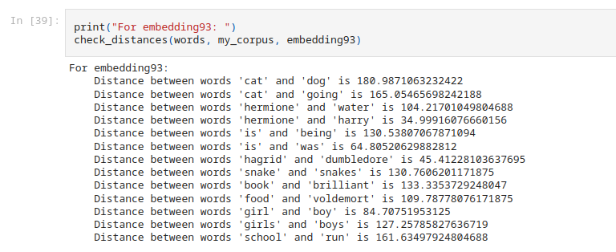
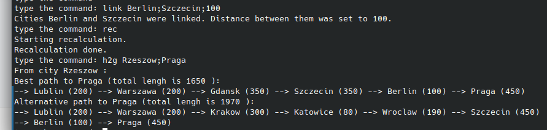
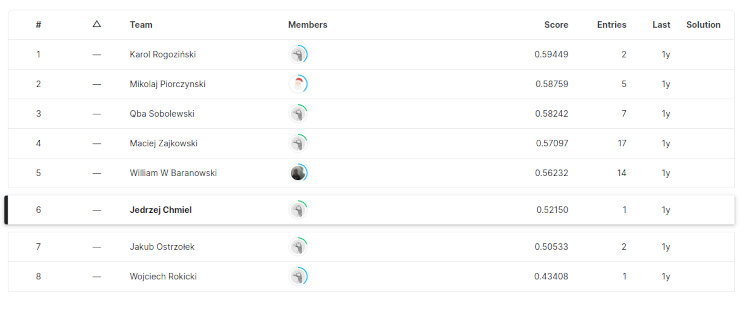
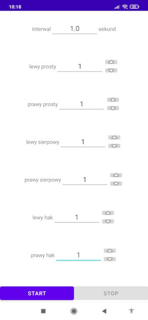
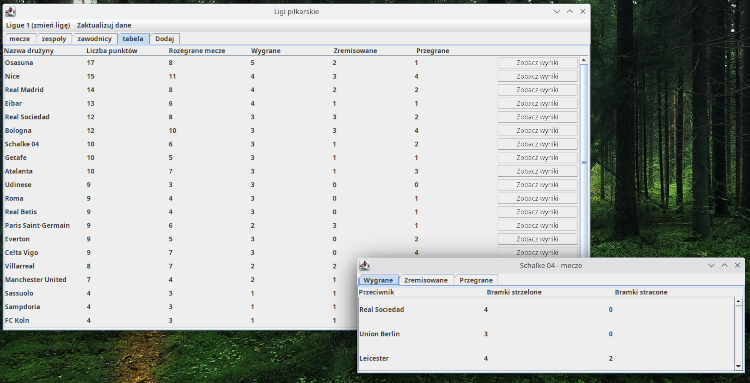
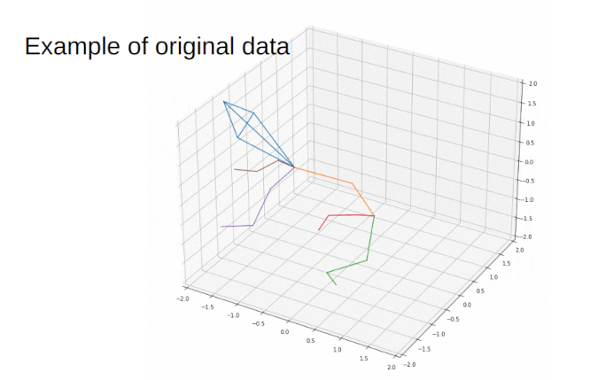
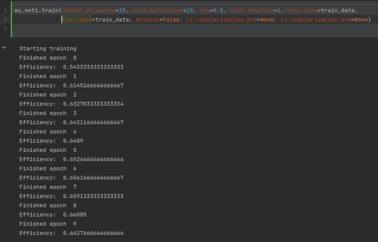
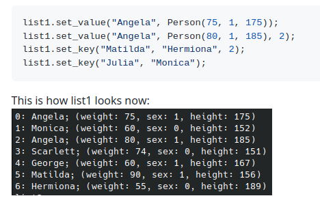

# Moje projekty

Cześć, nazywam się Jędrzej Chmiel, a to jest lista części moich projektów. Przy każdym projekcie znajduje się
* link do dokładnego opisu projektu (zazwyczaj jest to link do repozytorium na githabie do pliku README.md w którym znajduje się dokładny opis projektu)
* link do video z omówieniem danego projektu (jeżeli takie video istnieje)
* link do repozytorium
* jeden screeen

Jestem studentem drugiego roku informatyki na Politechnice Warszawskiej na WEiTI (Wydział Elektroniki i Technik Informacyjnych). Szukam praktyk/stażu/pracy na wakacje (2023 roku). Oto [link do mojego CV](https://drive.google.com/file/d/1WSfwEiToRkPZTQwJ-hS2UgAob4_LrOTU/view?usp=share_link), znajduje się w nim opis moich umiejętności i dane kontaktowe do mnie. Jeżeli chcesz się ze mną skontatkować, to najlepiej ***napisz do mnie na [LinkedIn (link)](https://www.linkedin.com/in/j%C4%99drzej-chmiel-481a8423b/)***

## Projekty:
1. próba stworzenia (i wytrenowania) [sieci neuronowej zdolnej do napisania nowego roździału Harrego Pottera](#harry-potter-chapter-writter-python-pytorch-jupyternotebook-numpy)
2. [symulacja protokołu routingu RIP](#symulacja-protokołu-rip-routing-information-protocol-c) (Routing Information Protocol)
3. implementacja algorytmy Uczenia Maszynowego ["AdaBoost"](#ada-boost-python-numpy-pandas)
4. [aplikacja na androida](#dukes-excercise-kotlin-android-studio) to trenowania uników przed uderzeniami
5. [aplikacja desktopowa](#league-viewer-java-swing-maven-sql) do przeglądanie informacji, związanych z piłką nożną, w różnych ligach, oraz dodawanie nowych informacji
6. [Generating Sequences of Rat Poses](#generating-sequences-of-rat-poses)
7. [sklep internetowy](#malwa-tea-php-javascript-sql-html-css) fikcyjnej firmy "malwa_tea" (strona internetowa)
8. [implementacja sztucznej sieci neuronowej](#nerual-network-python-numpy) (z trenowaniem, zapisywaniem, tylko przy użyciu NumPy) 
9. pełna implementacja [uogólnionej listy jednokierunkowej](#singly-linked-list-c)

 

---

 

## Harry Potter Chapter Writter (Python, Pytorch, JupyterNotebook, NumPy)
Próbowałem stworzyć i wytrenować sieć neuronową zdolną do napisania własnego rozdziału Harrego Pottera.
* [dokładny opis projektu](https://github.com/12jerek34jeremi/harry_potter/blob/main/explanation.ipynb)
* [repozytorium](https://github.com/12jerek34jeremi/harry_potter)

---
  
## Symulacja protokołu RIP (Routing Information Protocol) (C++)
Projekt map-rip to symulacja pierwszej wersji protokołu routingu RIP (Routing Information Protocoll). Protokół RIP jest, a właściwie był, używany w sieciach komputerowych przez routery do odnalezienia najlepszej drogi to innych routerów.Każdy router w sieci jest identyfikowany przez adres IP. Jednak, żeby projekt był czytelniejszy, zastąpiłem adresy IP nazwami miast, ale oprócz tego protokół działa tak samo jak RIP 1.
* [dokładny opis projektu](https://github.com/12jerek34jeremi/map_rip_protocol/blob/main/README_PL.md)
* [link do video](https://drive.google.com/file/d/1v48XZgSmH-Su3g6PAoOSJAcw1wl3UKvi/view?usp=share_link) z opisem projektu
* [repozytorium](https://github.com/12jerek34jeremi/map_rip_protocol)

---
  
## Ada Boost (Python, NumPy, Pandas)
Projekt AdaBoost to moja implementacja algorytmu Uczenia Maszynowego "AdaBoost". Użyłem tej implementacji w tym [konkursie na Kaggle (link)](https://www.kaggle.com/competitions/knsi-golem-bootcamp2021-competition/leaderboard) w którym zdobyłem 6 miejsce. Nie używałem żandych dodatkowych bibliotek Uczenia Maszynowego (typu scikit-learn lub PyTorch), całość jest napisana przy pomocy NumPy i Pandas.
* [repozytorium](https://github.com/12jerek34jeremi/AdaBoost)

---
  
## Dukes Excercise (Kotlin, Android Studio)
Aplikacja "Dukes Exercise" została napisana przez mnie przy pomocy Android Studio całkowicie w Kotlinie. Jest dostępna na [Play Store (link)](https://play.google.com/store/apps/details?id=zahenta.dukesexercise). Aplikacja służy do trenowania uników przed uderzeniami.
* [dokładny opis projektu](https://github.com/12jerek34jeremi/DukesExcercise/blob/main/README_PL.md)
* [link do video](https://drive.google.com/file/d/14v1DTA3-rx1C68ehiJzEjY5w-fsN8ktP/view?usp=share_link) z opisem projektu
* [repozytorium](https://github.com/12jerek34jeremi/DukesExcercise)

---
  
## League Viewer (java, Swing, Maven, SQL)
Aplikacja League Viewer była współtworzona przeze mnie w ramach projektu z Programownia Alikacyjnego na uczelni. Aplikacja umożliwia użytkownikom przeglądanie informacji związanych z piłką nożną w różnych ligach (meczy, druży, piłkarzy) oraz dodawanie nowych informacji.
* [dokładny opis projektu](https://github.com/12jerek34jeremi/league_viewer/blob/main/README_PL.md)
* [link do video](https://drive.google.com/file/d/1wyUm6_Vz_4pqdqQw1XxXmbbhKgX2G-dE/view?usp=share_link) z opisem projektu
* [repozytorium](https://github.com/12jerek34jeremi/league_viewer)

---
  
## Generating Sequences of Rat Poses
Brałem udział w wydarzeniu [BrainHack Warsaw 2022](https://brainhackwarsaw.github.io/), w którym to, razem z
innymi członkami zespołu, badaliśmy przestrzeń ukrytą algorytmu
Normalizing Flow. Algorytm ten przy pomocy funkcji odwracalnych zamienia
dany rozkład prawdopodobieństwa na rozkład normalny. Na koniec prezentowaliśmy nasz projekt. [link do prezentacji](https://docs.google.com/presentation/d/1G820T4yWyVaXoxoKl5m7DvrIJ4RtSjMvb2mgWAeKOYU/edit?usp=sharing) 

---
  
## Malwa Tea (PHP, javascript, SQL, HTML, CSS)
Malwa Tea to projekt strony internetowej sklepu internetowego fikcyjnej firmy Malwa Tea. Zahostowałem tą stronę na Amazon AWS, możesz kliknąc w [ten link](http://ec2-52-87-229-246.compute-1.amazonaws.com/), aby zobaczyć jak strona wygląda.
* [dokładny opis projektu](https://github.com/12jerek34jeremi/shop2/blob/main/README_PL.md)
* [link do video](https://drive.google.com/file/d/1TIuaRz3wrAIUWZIIjwZIPpy4jEbDsXGx/view?usp=share_link) z opisem projektu
* [repozytorium](https://github.com/12jerek34jeremi/shop2)

---
  
## Nerual Network (Python, NumPy)
Projekt Neural Network to implementacja sztucznej sieci neuronowej (razem z implementacją trenowania, testowania, regularyzacji oraz zapisywania do pliku i wczytywania modelu z pliku).
* [dokładny opis projektu](https://github.com/12jerek34jeremi/Neural-Network/blob/master/notebook.ipynb)
* [repozytorium](https://github.com/12jerek34jeremi/Neural-Network)

---
  
## Singly Linked List (C++)
Pełna implementacja uogólnionej listy jednokierunkowej. Pozwala na swtorzenie listy o dowolnym typie klucz i dowolnej typie wartości.
* [dokładny opis projektu](https://github.com/12jerek34jeremi/SLL/blob/main/README.md)
* [repozytorium](https://github.com/12jerek34jeremi/SLL)

